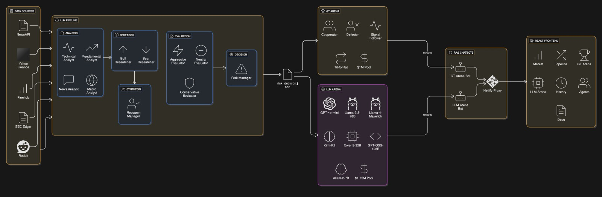

# TradeArena - A MATS (Multi-Agent Trading System)

A comprehensive AI-driven trading analysis system with game thepory strategies that coordinates 12+ specialized agents working collaboratively to analyze stocks, debate investment theses, and produce risk-adjusted trading decisions.

---

## ⚠️ IMPORTANT DISCLAIMER

**This project is designed for research and academic purposes only.** It is NOT intended for making real financial decisions or actual trading. The system is an experimental framework for studying multi-agent collaboration, game theory, and AI-driven decision-making. Users must conduct their own financial analysis and consult with licensed financial advisors before making any investment decisions. The authors assume no responsibility for financial losses or decisions made based on this system's outputs.

---

## Architecture Overview



The system orchestrates a multi-phase workflow where specialized agents analyze market data, construct opposing investment theses, debate their merits, and synthesize findings into risk-adjusted recommendations.

### System Workflow

1. **Phase 1: Market Analysis** → Four analyst agents (Technical, News, Fundamental, Macro) gather and discuss market signals
2. **Phase 2: Research Deep Dive** → Bull and Bear researchers construct opposing investment theses using analyst findings
3. **Phase 3: Risk Evaluation** → Three risk debators (Aggressive, Neutral, Conservative) assess the research from different perspectives
4. **Phase 4: Synthesis & Management** → Research Manager synthesizes debate; Risk Manager makes final decision with veto power
5. **Phase 5: Execution** → Trader creates detailed execution plan if approved

---

## Quick Start

### Prerequisites

- **Python 3.12+** (Recommended: 3.14)
- **Node.js 20+** (for the frontend)
- **FastAPI backend** (runs on port 8000)
- **Vite dev server** (runs on port 5173)

### Installation

1. **Clone the repository:**
   ```bash
   git clone <repository-url>
   cd game_theory_tests
   ```

2. **Set up Python environment:**
   ```bash
   # Create virtual environment (optional but recommended)
   python -m venv venv
   
   # Activate virtual environment
   # Windows:
   venv\Scripts\activate
   # macOS/Linux:
   source venv/bin/activate
   ```

3. **Install Python dependencies:**
   ```bash
   pip install -r requirements.txt
   ```

4. **Set up frontend:**
   ```bash
   cd gtrade-arena
   npm install
   ```

5. **Configure API Keys:**
   Create a `.env` file in the project root with the following keys:
   ```
   OPENAI_API_KEY=your_openai_api_key
   REDDIT_CLIENT_ID=your_reddit_client_id
   REDDIT_CLIENT_SECRET=your_reddit_client_secret
   NEWSAPI_KEY=your_newsapi_key
   FINNHUB_KEY=your_finnhub_key
   ALPHAVANTAGE_KEY=your_alphavantage_key
   ```
   
   See `api_keys.txt` for detailed setup instructions for each API.

### Running the System

#### Option 1: Full Pipeline via API (Recommended)

**Terminal 1 - Start Backend:**
```bash
cd app
python -m uvicorn api:app --reload --port 8000
```

**Terminal 2 - Start Frontend:**
```bash
cd gtrade-arena
npm run dev
```

Then open `http://localhost:5173` in your browser and use the Pipeline page to run analysis.

#### Option 2: Direct Command Line Execution

**Full Analysis Pipeline:**
```bash
cd agents/orchestrators
python master_orchestrator.py AAPL --research-mode deep --portfolio-value 100000
```

**Mandatory Parameters:**
- `ticker` - Stock ticker symbol (e.g., `AAPL`, `GOOGL`, `TSLA`)

**Optional Parameters:**
- `--research-mode` - Analysis depth: `shallow` (quick, ~2 min), `deep` (3 rounds, ~5 min), `research` (5 rounds, ~8 min). Default: `shallow`
- `--portfolio-value` - Portfolio size in dollars for position sizing. Default: `100000`
- `--research-rounds` - Override number of debate rounds. Default: auto-based on mode
- `--analysis-date` - Historical analysis date in `YYYY-MM-DD` format for backtesting

**Examples:**
```bash
# Quick analysis
python master_orchestrator.py AAPL

# Deep research with custom portfolio
python master_orchestrator.py TSLA --research-mode deep --portfolio-value 250000

# Historical backtesting
python master_orchestrator.py GOOGL --analysis-date 2024-06-15 --research-mode research

# Full research with 5 debate rounds
python master_orchestrator.py MSFT --research-mode research
```

#### Option 3: Run Individual Phases for Debugging

```bash
# Phase 1: Analysts only
python master_orchestrator.py AAPL --phases phase1

# Phase 1 + Phase 2
python master_orchestrator.py AAPL --phases phase1 phase2

# Specific phase
cd agents/analyst
python technical_agent.py AAPL --days 30
```

---

## Project Structure

```
game_theory_tests/
├── README.md                          # Repo guide
├── requirements.txt                   # Python dependencies
├── api_keys.txt                       # API key configuration guide
├── LICENSE
├── .env                               # Environment variables (create this)
│
├── app/
│   └── api.py                        # FastAPI backend
│
├── agents/                           # Core trading agents
│   ├── analyst/                      # Market analysts
│   │   ├── technical_agent.py       # Technical analysis
│   │   ├── news_agent.py            # News sentiment analysis
│   │   ├── fundamental_agent.py     # Fundamental analysis
│   │   └── macro_agent.py           # Macro analysis
│   │
│   ├── researcher/                  # Investment thesis builders
│   │   ├── bull_researcher.py       # Bullish case builder
│   │   └── bear_researcher.py       # Bearish case builder
│   │
│   ├── risk_management/             # Risk evaluators
│   │   ├── aggressive_debator.py    # High-risk perspective
│   │   ├── neutral_debator.py       # Balanced perspective
│   │   └── conservative_debator.py  # Low-risk perspective
│   │
│   ├── managers/                    # Decision makers
│   │   ├── research_manager.py      # Synthesizes research
│   │   ├── risk_manager.py          # Takes the final decision
│   │   └── portfolio_manager.py     # Portfolio management
│   │
│   ├── execution/                   # Trade execution
│   │   ├── trader.py                # Creates execution plans
│   │   └── final_order.json         # Generated trade orders
│   │
│   ├── orchestrators/               # Workflow coordinators
│   │   ├── master_orchestrator.py   # Main pipeline orchestrator
│   │   ├── discussion_hub.py        # Analyst discussion coordinator
│   │   ├── batch_collect_all.py     # Batch processing
│   │   └── orchestrator_agent.py    # Individual orchestrator
│   │
│   ├── llm_arena/                   # LLM Arena for multi-LLM evaluation
│   │   ├── llm_arena.py             # Main arena coordinator
│   │   ├── arena_scheduler.py       # Schedules arena/tournament among multiple LLMs
│   │   ├── data_collector.py        # Collects data for LLM Trading Arena
│   │   └── preprocess_llm_arena.py  # Preprocesses arena results
│   │
│   ├── game_theory/                 # Game theory analysis
│   │   ├── game_state.py            # Game state management
│   │   ├── gt_engine.py             # Game theory engine
│   │   ├── market_context.py        # Market context
│   │   ├── metrics_calculator.py    # Performance metrics
│   │   ├── monte_carlo_engine.py    # Monte Carlo simulations (for evaluation)
│   │   ├── regime_detector.py       # Market regime detection
│   │   ├── data_loader.py           # Data loading utilities
│   │   ├── run_analysis.py          # Analysis runner
│   │   ├── visualization_engine.py  # Visualization tools
│   │   └── strategies/              # Game theory strategies
│   │       ├── base.py              # Base strategy class
│   │       ├── buy_hold.py          # Buy & hold strategy
│   │       ├── cooperator.py        # Cooperator strategy
│   │       ├── defector.py          # Defector strategy
│   │       ├── signal_follower.py   # Signal follower strategy
│   │       └── tit_for_tat.py       # Tit-for-tat strategy
│   │
│   └── tests/                       # Unit tests
│       ├── gtmats_test.py           # MATS game theory tests
│       ├── smart_gtmats.py          # Smart MATS tests
│       ├── test_data_structure.py   # Data structure tests
│       └── test_gtmats.py           # Additional MATS tests
│
├── gtrade-arena/                    # React Frontend (Vite)
│   ├── vite.config.js              # Vite configuration with API proxy
│   ├── package.json
│   ├── index.html
│   ├── src/
│   │   ├── main.jsx
│   │   ├── App.jsx
│   │   ├── pages/
│   │   │   ├── PipelinePage.jsx    # Main pipeline UI
│   │   │   ├── ArenaPage.jsx       # LLM arena
│   │   │   ├── MarketPage.jsx      # Market analysis
│   │   │   └── ...
│   │   ├── components/             # React components
│   │   ├── hooks/                  # Custom React hooks
│   │   └── utils/                  # Utility functions
│   └── public/                      # Static assets
│
├── outputs/                         # Generated analysis outputs
│   ├── discussion_points.json      # Phase 1 output
│   ├── bull_thesis.json            # Phase 2 output
│   ├── bear_thesis.json            # Phase 2 output
│   ├── aggressive_eval.json        # Phase 3 output
│   ├── neutral_eval.json           # Phase 3 output
│   ├── conservative_eval.json      # Phase 3 output
│   ├── research_synthesis.json     # Phase 4 output
│   ├── risk_decision.json          # Phase 4 output
│   ├── final_order.json            # Phase 5 output
│   └── [ticker]/                   # Historical analysis by ticker
│
└── cli/
    └── master_cli.py               # CLI interface
```

---

## Required Python Packages

The system requires the following packages (see `requirements.txt`):

**Core Dependencies:**
- `fastapi` - Web framework for the API
- `uvicorn` - ASGI server for FastAPI
- `python-dotenv` - Environment variable management
- `pydantic` - Data validation

**Data & Analysis:**
- `pandas` - Data manipulation and analysis
- `numpy` - Numerical computing
- `yfinance` - Stock market data

**API & Web:**
- `openai` - OpenAI API client
- `requests` - HTTP client library
- `praw` - Reddit API wrapper


**Optional for Game Theory:**
- `matplotlib` - Visualization
- `seaborn` - Statistical visualizations

Install all at once:
```bash
pip install -r requirements.txt
```

---

## API Keys Setup

### Required API Keys

The system uses multiple data sources. Get your keys from:

1. **OpenAI** (for LLM analysis)
   - Visit: https://platform.openai.com/api-keys
   - Create API key and set `OPENAI_API_KEY`

2. **Finnhub** (for market data)
   - Visit: https://finnhub.io/register
   - Free tier available
   - Set `FINNHUB_KEY`

3. **NewsAPI** (for news sentiment)
   - Visit: https://newsapi.org
   - Free tier available
   - Set `NEWSAPI_KEY`

4. **Reddit** (for social sentiment)
   - Visit: https://www.reddit.com/prefs/apps
   - Create OAuth app
   - Set `REDDIT_CLIENT_ID` and `REDDIT_CLIENT_SECRET`

5. **Alpha Vantage** (alternative data source)
   - Visit: https://www.alphavantage.co/
   - Set `ALPHAVANTAGE_KEY`

### Setup Instructions

**Windows (PowerShell):**
```powershell
$env:OPENAI_API_KEY = "your_key_here"
$env:FINNHUB_KEY = "your_key_here"
# ... other keys
```

**macOS/Linux (Bash):**
```bash
export OPENAI_API_KEY="your_key_here"
export FINNHUB_KEY="your_key_here"
# ... other keys
```

**Permanent (Recommended):**
Create a `.env` file in the project root:
```
OPENAI_API_KEY=sk-...
REDDIT_CLIENT_ID=...
REDDIT_CLIENT_SECRET=...
NEWSAPI_KEY=...
FINNHUB_KEY=...
ALPHAVANTAGE_KEY=...
```

---

## Demo & Weekly Updates

- **Live Demo UI**: [TradeArena](https://www.tradearena.site)
- **Weekly Updates**: [Weekly Updates](https://docs.google.com/document/d/1QnFzBTIzh1E66WQDzSUWXoSTA05o-UJ19tS519vi9Es/)
- **Documentation**: [TradingAgents Documentation](https://docs.google.com/document/d/1LmyGEkRfH9ssQLZDCqSbk1XKH7hVgTTuaZsufn0In9g/)

---

## Understanding the Output

After running the pipeline, check the `outputs/` folder for:

| File | Contents | Phase |
|------|----------|-------|
| `discussion_points.json` | Analyst consensus and market signals | 1 |
| `bull_thesis.json` | Bullish investment case with catalysts | 2 |
| `bear_thesis.json` | Bearish investment case with risks | 2 |
| `aggressive_eval.json` | High-risk perspective evaluation | 3 |
| `neutral_eval.json` | Balanced perspective evaluation | 3 |
| `conservative_eval.json` | Low-risk perspective evaluation | 3 |
| `research_synthesis.json` | Synthesized research findings | 4 |
| `risk_decision.json` | **Final trading decision** | 4 |
| `final_order.json` | Execution details (if approved) | 5 |

The **`risk_decision.json`** contains the final recommendation:
- **APPROVE**: Trade approved with full position sizing
- **MODIFY**: Trade approved with reduced position size
- **REJECT**: Trade rejected due to risk concerns

---

## System Features

### Multi-Phase Analysis
- Separates analysis, research, evaluation, and decision-making
- Each phase builds on previous results

### Risk Management
- Risk Manager has veto power over all recommendations
- Position sizing based on portfolio value and risk tolerance
- Automatic stop loss and profit target calculation

### Debate & Synthesis
- Bull and Bear researchers construct opposing cases
- Three risk debators evaluate from different perspectives
- Research Manager synthesizes conflicting viewpoints

### Historical Backtesting
- Analyze historical data with `--analysis-date` parameter
- Test strategies on past market conditions

### Multiple Research Modes
- **Shallow**: Quick analysis for rapid decisions
- **Deep**: Moderate analysis with multiple debate rounds
- **Research**: Comprehensive analysis with extensive debate

---

## Troubleshooting

### Connection Error: "Unexpected end of JSON input"
This error occurs when the frontend cannot properly parse the API response. Ensure:
1. FastAPI backend is running on port 8000: `python -m uvicorn api:app --reload`
2. Vite proxy is configured correctly in `vite.config.js`
3. API endpoints return valid JSON responses

### Missing API Keys
Ensure all required API keys are set in your `.env` file. See "API Keys Setup" section above.

### Module Import Errors
Make sure you've installed all dependencies:
```bash
pip install -r requirements.txt
```

### Port Already in Use
If port 8000 or 5173 is in use:
```bash
# FastAPI on different port
python -m uvicorn api:app --reload --port 8001

```


